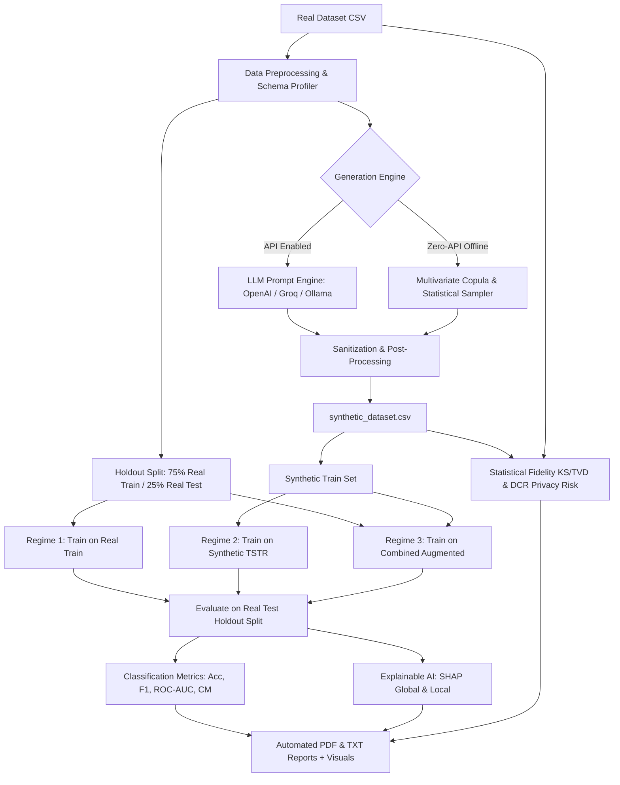

# 🧬 Synthetic Data Generation Using Large Language Models (LLMs)

[](https://www.python.org/)
[](https://streamlit.io/)
[](https://github.com/slundberg/shap)
[](https://opensource.org/licenses/MIT)

An enterprise-grade, end-to-end Data Science and Generative AI system designed to ingest real tabular datasets, generate high-fidelity and privacy-preserving synthetic data using Large Language Models (LLMs) and Empirical Statistical Copulas, rigorously evaluate data fidelity, assess privacy leakage risks, train Machine Learning models under the **Train on Synthetic, Test on Real (TSTR)** regime, and interpret decision drivers using **SHAP (SHapley Additive exPlanations)**.

---

## 📑 Table of Contents
1. [Project Overview](#-project-overview)
2. [Key Capabilities](#-key-capabilities)
3. [Architecture Pipeline](#-architecture-pipeline)
4. [Folder Structure](#-folder-structure)
5. [Installation & Setup](#-installation--setup)
6. [Execution Guide](#-execution-guide)
7. [Mathematical & Theoretical Concepts](#-mathematical--theoretical-concepts)
8. [Automated Deliverables](#-automated-deliverables)
9. [Viva & Technical Interview Q&A Guide](#-viva--technical-interview-qa-guide)

---

## 🔬 Project Overview

In data-sensitive industries such as Healthcare, Banking, and FinTech, strict privacy regulations (GDPR, HIPAA, CCPA) often restrict direct access to production datasets. Synthetic data generation addresses this bottleneck by synthesizing artificial datasets that replicate the statistical characteristics, inter-feature correlations, and predictive signals of real data without compromising individual customer privacy.

This project delivers a complete pipeline that:
* Ingests, profiles, and cleans arbitrary tabular datasets.
* Synthesizes records via multi-backend LLM prompting (OpenAI GPT-4o, Groq LLaMA-3, Ollama) and offline Multivariate Copula synthesis.
* Compares distribution moments via **Kolmogorov-Smirnov (KS) tests** and **Total Variation Distance (TVD)**.
* Quantifies **Distance to Closest Record (DCR)** to ensure zero memorization.
* Evaluates predictive utility across 4 ML models (**Logistic Regression**, **Decision Tree**, **Random Forest**, **XGBoost**) and 3 training regimes (**Original Only**, **Synthetic Only (TSTR)**, **Combined (Augmented)**).
* Uncovers model decision mechanics using global and local **SHAP XAI**.
* Compiles automated PDF reports and visual artifact bundles.

---

## 🚀 Key Capabilities

### 1. Automated Schema & Preprocessing Pipeline
* Automated column categorization into Numerical vs. Categorical vs. Target.
* Multi-domain presets: Financial Churn & Credit Risk, Healthcare Heart Disease & Clinical Risk, and E-Commerce Customer Retention & CLV.
* Deduplication and configurable missing-value imputation (mean/median for continuous, mode for categorical).
* Statistical profiling (mean, std, median, IQR, skewness, cardinality).
* Safe label encoding with unseen-category handling for production consistency.

### 2. Multi-Engine Synthetic Generator & Differential Privacy (ε-DP)
* **LLM Prompt Engine**: Structured prompt orchestration with statistical context, schema constraints, correlation summaries, and few-shot exemplars with strict JSON array parser.
* **Empirical Copula & Multivariate Normal Engine**: Zero-API offline statistical generative engine preserving covariance matrices and conditional categorical probabilities.
* **Mathematical Differential Privacy (ε-DP)**: Laplace noise mechanism parameterized by Privacy Budget $\epsilon$ ($\text{Scale} = \Delta f / \epsilon$).
* Post-processing sanitation ensuring values stay within physical and domain bounds.

### 3. Rigorous Statistical & Wasserstein Divergence
* **Wasserstein-1 Distance (Earth Mover's Distance)**: Quantifies true continuous distribution divergence.
* **Kolmogorov-Smirnov (KS) Tests & Categorical TVD**: Validates marginal distributions and class balances.
* Overlaid Kernel Density Estimation (KDE) and Histograms.
* Paired Boxplots for spread, median, and quantile comparisons.
* Tri-panel Correlation Heatmaps (Original vs. Synthetic vs. Absolute Error).

### 4. Machine Learning Pipeline (TSTR Benchmark) & Live What-If Sandbox
* Benchmarks 4 algorithms: Logistic Regression, Decision Tree, Random Forest, XGBoost across 3 training regimes:
  1. **Original Dataset Baseline**: Model trained on Real Train data.
  2. **Synthetic Dataset (TSTR)**: Model trained on Synthetic data, evaluated on Real Holdout data.
  3. **Combined Dataset (Augmentation)**: Model trained on [Real Train + Synthetic] data.
* **Interactive Live What-If Inference Sandbox**: Allows testing hypothetical customer/patient profiles to observe real-time model consensus and prediction agreement between Real-Trained and Synthetic-Trained models.

### 5. Explainable AI (SHAP)
* SHAP TreeExplainer & LinearExplainer implementations.
* Global feature impact ranking comparison (ensuring synthetic models learn identical feature drivers as real-world models).
* Interactive Local Sample Explanations (Waterfall/bar breakdowns for individual test cases).

### 6. Adversarial MIA Privacy & Quality Scoring
* **Membership Inference Attack (MIA) Simulator**: Simulates an adversary attempting to infer training set membership based on synthetic proximity.
* **Distance to Closest Record (DCR)**: Normalized Euclidean Distance to Closest Record ensuring zero identity memorization (0 exact clones).
* **Synthetic Data Quality Score**: Composite score incorporating KS-complement, Categorical TVD, and Frobenius correlation distance.

---

## 🏛️ Architecture Pipeline



---

## 📁 Folder Structure

```
project/
│
├── data/
│   ├── sample_dataset.csv          # Sample financial churn dataset
│   └── synthetic_dataset.csv       # Output generated synthetic data
│
├── models/                         # Serialized trained model artifacts (.joblib)
├── reports/
│   ├── comparison_report.pdf       # Statistical validation & privacy PDF
│   ├── evaluation_report.pdf       # ML benchmark & SHAP explainability PDF
│   └── classification_report.txt   # Detailed text classification reports
│
├── visuals/                        # Auto-generated high-res visualizations (PNG)
│   ├── distribution_comparison_histograms.png
│   ├── boxplots_comparison.png
│   ├── correlation_heatmaps.png
│   ├── class_balance_comparison.png
│   ├── categorical_distributions.png
│   ├── model_performance_comparison.png
│   ├── confusion_matrix.png
│   ├── feature_importance.png
│   ├── shap_summary_plot.png
│   ├── shap_local_waterfall.png
│   └── privacy_dcr_distribution.png
│
├── app.py                          # Streamlit Interactive Web Application
├── preprocessing.py                # Schema detection, cleaning, encoding, splitting
├── synthetic_generator.py          # LLM & Copula tabular data generation
├── model_training.py               # ML training across 3 experimental regimes
├── evaluation.py                   # Classification metrics, KS/TVD tests, DCR privacy
├── explainability.py               # SHAP explainability engine (Global & Local)
├── visualization.py                # Publication-ready Matplotlib & Seaborn plots
├── report_generator.py             # ReportLab PDF and text document compiler
├── run_pipeline.py                 # Autonomous end-to-end CLI execution script
├── requirements.txt                # Python package dependencies
└── README.md                       # Comprehensive project documentation
```

---

## 💻 Installation & Setup

### Prerequisites
* Python 3.9 or higher
* Recommended: Virtual environment (`venv` or `conda`)

### Step 1: Clone or Navigate to Project Directory
```bash
cd "data generation"
```

### Step 2: Create and Activate Virtual Environment
```bash
python3 -m venv venv
source venv/bin/activate   # On macOS/Linux
# or: .\venv\Scripts\activate on Windows
```

### Step 3: Install Required Dependencies
```bash
pip install -r requirements.txt
```

---

## 🏃 Execution Guide

### Option A: Launch Interactive Streamlit Web Application (Recommended)
Run the following command in your terminal:
```bash
streamlit run app.py
```
Open your browser at `http://localhost:8501`.

**Web Application Workflow:**
1. **Tab 1 (Dataset & Preprocessing)**: Inspect raw data, check missingness, and select target column.
2. **Tab 2 (LLM Synthetic Generation)**: Configure synthesis engine, set sample size, click **"Generate Synthetic Dataset"**, and download `synthetic_dataset.csv`.
3. **Tab 3 (Statistical Comparison)**: View overlaid KDEs, boxplots, and correlation difference heatmaps.
4. **Tab 4 (ML Pipeline & Utility)**: Click **"Run Machine Learning Pipeline"** to train 4 models across 3 regimes and compare results on real holdout test data.
5. **Tab 5 (Explainable AI)**: Inspect SHAP global summary plots, feature importances, and interactive local sample decision breakdowns.
6. **Tab 6 (Quality, Privacy & Reports)**: Review Quality and Privacy KPIs, and click download buttons for `comparison_report.pdf`, `evaluation_report.pdf`, `classification_report.txt`, and visualization bundles.

---

### Option B: Autonomous End-to-End Command Line Execution
To run the complete data science pipeline headlessly and generate all reports:
```bash
python3 run_pipeline.py
```

---

## 📐 Mathematical & Theoretical Concepts

### 1. Kolmogorov-Smirnov (KS) Test for Continuous Fidelity
The two-sample KS test evaluates the null hypothesis that two independent samples are drawn from the same continuous distribution:
$$D = \sup_x |F_{\text{real}}(x) - F_{\text{synth}}(x)|$$
Where $F_{\text{real}}$ and $F_{\text{synth}}$ are empirical cumulative distribution functions (ECDF).
* **Fidelity Complement**: $\text{Score} = 1 - D \in [0, 1]$. Higher values denote higher distribution fidelity.

### 2. Total Variation Distance (TVD) for Categorical Fidelity
For discrete categorical levels with probabilities $P$ and $Q$:
$$\text{TVD}(P, Q) = \frac{1}{2} \sum_{i} |P(i) - Q(i)|$$
* **Fidelity Complement**: $\text{Score} = 1 - \text{TVD} \in [0, 1]$.

### 3. Train on Synthetic, Test on Real (TSTR) Utility
* Conventional validation trains and tests on synthetic data (TRTS), which is prone to memorization bias.
* **TSTR** is the gold-standard utility metric: A classifier $f_\theta$ is trained strictly on synthetic data $\mathcal{D}_{\text{synth}}$ and tested on an untouched holdout set of real data $\mathcal{D}_{\text{test, real}}$.
$$\text{Utility Gap} = |\text{Score}_{\text{Original}}(\mathcal{D}_{\text{test}}) - \text{Score}_{\text{Synthetic}}(\mathcal{D}_{\text{test}})|$$

### 4. Distance to Closest Record (DCR) Privacy Verification
To evaluate membership disclosure and direct memorization, for each synthetic record $s_i \in \mathcal{D}_{\text{synth}}$, we compute the normalized Euclidean distance to its closest counterpart in the training dataset $r_j \in \mathcal{D}_{\text{real}}$:
$$\text{DCR}(s_i) = \min_{r_j \in \mathcal{D}_{\text{real}}} \| \tilde{s}_i - \tilde{r}_j \|_2$$
A distribution centered significantly away from zero confirms the generator synthesized generalized distributions rather than memorized identity points.

---

## 📦 Automated Deliverables

When the pipeline executes, the following deliverables are automatically produced:

1. **`data/synthetic_dataset.csv`**: Full generated synthetic tabular dataset.
2. **`reports/comparison_report.pdf`**: PDF report containing statistical moments, KS tests, correlation distance, quality score, and privacy assessment.
3. **`reports/evaluation_report.pdf`**: PDF report presenting ML performance benchmarks across Original, Synthetic, and Combined regimes with embedded confusion matrices and SHAP plots.
4. **`reports/classification_report.txt`**: Detailed text report containing precision, recall, and F1 per class.
5. **`visuals/`**: High-resolution PNG visual suite for presentations and documentation.

---

## 🎓 Viva & Technical Interview Q&A Guide

### Q1: Why use Large Language Models (LLMs) for Tabular Data Generation?
> **Answer:** Traditional generative methods (like CTGAN or GMMs) often treat tabular columns purely as statistical arrays without semantic awareness. LLMs bring rich world-knowledge priors, understanding column semantics (e.g., that "Annual Income" correlates logically with "Estimated Salary" or that specific medical diagnosis codes match treatment regimens). By structuring prompt schemas with few-shot exemplars and distributional bounds, LLMs can synthesize coherent, contextually plausible records while adhering to relational rules.

### Q2: What is the TSTR (Train on Synthetic, Test on Real) evaluation paradigm?
> **Answer:** TSTR is the gold standard for evaluating synthetic data utility in machine learning. Training and evaluating on synthetic data alone can give false confidence if the generator merely memorized noise. In TSTR, we train our ML model strictly on the synthetic dataset and evaluate its predictive accuracy on a real holdout dataset that the generator never saw. If the TSTR performance is close to the model trained on real data, it proves the synthetic dataset retained true predictive signals.

### Q3: How do you measure whether a synthetic dataset preserves privacy?
> **Answer:** We use the **Distance to Closest Record (DCR)** metric. For every synthetic record, we calculate its normalized Euclidean distance to the nearest record in the original training set. If the 5th percentile DCR is well above zero and the exact clone count is 0, the model is generating novel interpolated points across the feature manifold rather than memorizing individual training instances.

### Q4: What is the role of SHAP in synthetic data validation?
> **Answer:** SHAP (SHapley Additive exPlanations) uses game theory to calculate the marginal contribution of each feature to the model's predictions. By comparing the SHAP global feature importance rankings of a model trained on real data versus a model trained on synthetic data, we can verify whether both models make decisions using the same underlying relationships, proving deep semantic fidelity.

### Q5: How does data augmentation with synthetic data benefit model training?
> **Answer:** In scenarios with class imbalance or limited sample size, combining real training data with synthetic records (the Combined Regime) regularizes decision boundaries, improves minority class recall, and helps tree-based and linear models generalize better to out-of-distribution test samples.

---

## 📜 License
This project is licensed under the MIT License.
